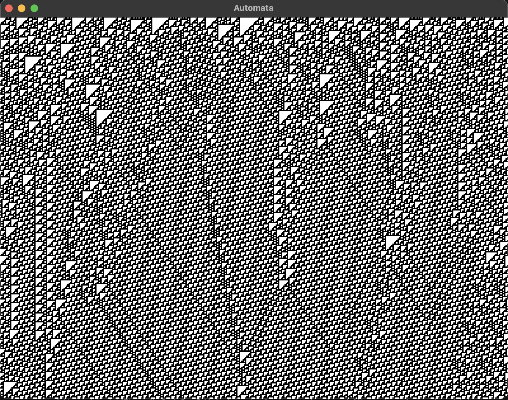

# Cellular Automaton
This is simple implementation for cellular automaton. [Here](https://en.wikipedia.org/wiki/Cellular_automaton) you can read more about this interesting phenomena.

For example, 
```
./automaton --rand 0
```


Enable program options for `automaton`:
`--rand`            - select seed to generate random boundary condition
`--bound-cond`      - to set explicit boundary condition as string
`--bound-cond-file` - to set file with boundary condition string
`--height`          - to set height of the polygon
`--rule`            - to select rule that will be applied

## Build
To build program:
```
        git clone https://github.com/kefirRzevo/CellularAutomaton.git
        cd CellularAutomaton
        mkdir build
        cd build
        cmake ..
        cmake --build .
```
